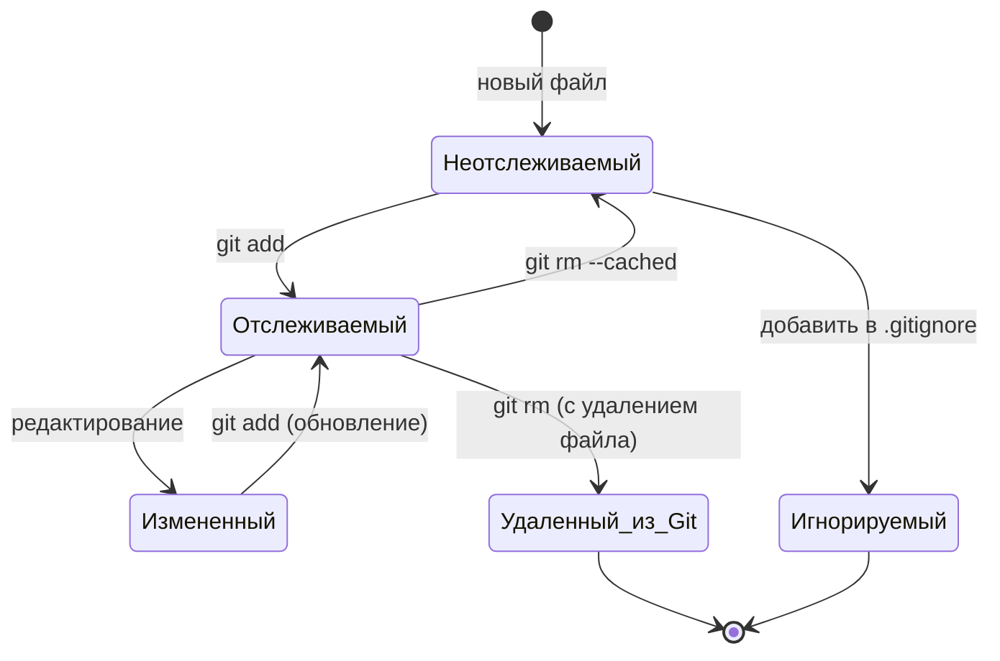

# 📚 Теория: команда `git rm -r --cached`

## 🎯 Что это за команда

**`git rm -r --cached`** - это команда для **удаления файлов из индекса Git (staging area)** без удаления самих файлов из рабочей директории.

### Визуальное представление:
```
┌─────────────────┐     ┌─────────────────┐     ┌─────────────────┐
│  Рабочая        │     │  Индекс         │     │  Репозиторий    │
│  директория     │ --> │  (staging)      │ --> │  (Git history)  │
│  (файлы на     │     │  (готовится к   │     │  (уже сохранено)│
│  диске)         │     │   коммиту)      │     │                 │
└─────────────────┘     └─────────────────┘     └─────────────────┘
        │                        │                        
        │    git rm --cached      │                        
        │    ────────────────────>│                        
        │    (удаляет из индекса) │                        
        │                         │                        
        ↓                         ↓                        
    Файл остается          Файл удаляется                 
    на диске               из индекса                     
```

---

## 📊 Разбор команды по частям

```bash
git rm -r --cached
```

| Часть команды | Значение | Что делает |
|---------------|----------|-------------|
| `git rm` | Базовая команда | Удаление файлов из индекса и/или рабочей директории |
| `-r` | `--recursive` | Рекурсивное удаление (для папок) |
| `--cached` | Только из индекса | Не трогает файлы на диске |

---

## 🔬 Детальный разбор

### 1. **`git rm` - удаление файлов**

**Обычное поведение (без --cached):**
```bash
git rm file.txt
# Удаляет file.txt из рабочей директории И из индекса
```

**С --cached:**
```bash
git rm --cached file.txt
# Удаляет file.txt ТОЛЬКО из индекса
# Файл остается в рабочей директории
```

### 2. **`-r` (recursive) - для папок**

```bash
# Без -r - ошибка
git rm --cached folder/
# error: not removing 'folder/' recursively without -r

# С -r - работает рекурсивно
git rm -r --cached folder/
# Удаляет все файлы в папке из индекса
```

### 3. **`--cached` - только индекс**

| Без --cached | С --cached |
|--------------|------------|
| Удаляет из рабочей директории | ❌ НЕ удаляет |
| Удаляет из индекса | ✅ Удаляет из индекса |
| Файл исчезает с диска | Файл остается на диске |

---

## 📋 Сравнение с другими командами

| Команда | Рабочая директория | Индекс (staging) | История Git |
|---------|--------------------|------------------|-------------|
| `rm file.txt` | ✅ Удаляет | ❌ Не трогает | ❌ Не трогает |
| `git rm file.txt` | ✅ Удаляет | ✅ Удаляет | ❌ Не трогает |
| `git rm --cached file.txt` | ❌ Не трогает | ✅ Удаляет | ❌ Не трогает |
| `git rm --cached -r folder/` | ❌ Не трогает | ✅ Удаляет рекурсивно | ❌ Не трогает |
| `git reset file.txt` | ❌ Не трогает | Возвращает к HEAD | ❌ Не трогает |
| `git clean -fd` | ✅ Удаляет неотслеживаемые | ❌ Не трогает | ❌ Не трогает |

---

## 🎯 Типичные сценарии использования

### Сценарий 1: Перестать отслеживать файл (но оставить локально)

```bash
# Файл уже в Git, но вы хотите его игнорировать
git rm --cached config/local.php
echo "config/local.php" >> .gitignore
git add .gitignore
git commit -m "Stop tracking local config"
```

### Сценарий 2: Очистка индекса от папки (node_modules)

```bash
# Случайно добавили node_modules в Git
git add node_modules/  # ОШИБКА!

# Исправляем: удаляем из индекса, но оставляем локально
git rm -r --cached node_modules/
echo "node_modules/" >> .gitignore
git add .gitignore
git commit -m "Remove node_modules from tracking"
```

### Сценарий 3: Исправление неправильно добавленных файлов

```bash
# Добавили слишком много файлов
git add .  # Добавил все, включая temp файлы

# Убираем временные файлы из индекса
git rm --cached *.tmp
git rm --cached logs/*.log

# Теперь коммитим только нужное
git commit -m "Initial commit"
```

---

## 🔄 Жизненный цикл файла с git rm --cached



---

## 💻 Практические примеры

### Пример 1: Удаление одного файла из отслеживания
```bash
# Создаем и коммитим файл
echo "secret" > config.php
git add config.php
git commit -m "Add config"

# Решаем, что файл не должен быть в Git
git rm --cached config.php
echo "config.php" >> .gitignore
git add .gitignore
git commit -m "Stop tracking config.php"

# Файл config.php остался на диске, но больше не в Git
ls config.php  # файл существует
git status     # config.php не показывается
```

### Пример 2: Удаление целой папки
```bash
# Случайно закоммитили папку vendor (Composer)
git add vendor/
git commit -m "Add vendor"

# Понимаем, что vendor не нужно в Git
git rm -r --cached vendor/
echo "vendor/" >> .gitignore
git add .gitignore
git commit -m "Remove vendor from tracking"

# Папка vendor осталась локально
ls -la vendor/  # все файлы на месте
```

### Пример 3: Массовое удаление по шаблону
```bash
# Удалить все .log файлы из индекса
git rm --cached *.log

# Удалить все файлы в папке logs/
git rm -r --cached logs/

# Удалить все файлы с определенным расширением
find . -name "*.tmp" -exec git rm --cached {} \;
```

---

## ⚠️ Важные нюансы

### 1. **Файл остается в истории**
```bash
git rm --cached file.txt
# Файл удаляется из индекса, но ОСТАЕТСЯ в истории коммитов!
# Чтобы удалить из истории: git filter-branch или BFG Repo-Cleaner
```

### 2. **Нужен коммит после команды**
```bash
git rm --cached file.txt
git status  # Changes to be committed: deleted: file.txt
git commit -m "Stop tracking file.txt"  # Обязательно!
```

### 3. **Работа с .gitignore**
```bash
# Правильный порядок действий:
# 1. Удалить из индекса
git rm -r --cached folder/

# 2. Добавить в .gitignore
echo "folder/" >> .gitignore

# 3. Закоммитить изменения
git add .gitignore
git commit -m "Ignore folder"
```

---

## 📊 Сравнение с похожими операциями

| Операция | Команда | Файл на диске | Файл в индексе | Файл в истории |
|----------|---------|---------------|----------------|----------------|
| Удалить из проекта | `rm file.txt` | ❌ Нет | ✅ Есть | ✅ Есть |
| Удалить из Git (без файла) | `git rm file.txt` | ❌ Нет | ❌ Нет | ✅ Есть |
| Перестать отслеживать | `git rm --cached file.txt` | ✅ Есть | ❌ Нет | ✅ Есть |
| Удалить из истории | `git filter-branch` | ✅/❌ | ❌ Нет | ❌ Нет |

---

## 🎯 Итог: когда использовать

**Используйте `git rm -r --cached` когда:**
- ✅ Нужно перестать отслеживать файлы/папки
- ✅ Случайно добавили не те файлы (node_modules, .env, vendor)
- ✅ Хотите оставить файлы локально, но убрать из Git
- ✅ Нужно рекурсивно обработать папку

**НЕ используйте когда:**
- ❌ Хотите удалить файлы с диска (используйте `git rm` без `--cached`)
- ❌ Хотите удалить файлы из истории (нужен `filter-branch`)
- ❌ Работаете с неотслеживаемыми файлами (используйте `rm` или `git clean`)

---

## 📚 Проверочные вопросы

### Вопрос 1
Что произойдет с файлом `config.php` на диске после выполнения `git rm --cached config.php`?

**A)** Файл будет удален с диска  
**B)** Файл останется на диске, но перестанет отслеживаться Git  
**C)** Файл останется в индексе, но удалится с диска  
**D)** Команда вызовет ошибку

<details><summary><b>Ответ:</b></summary>

**B** - `--cached` означает "только из индекса". Файл остается в рабочей директории, но Git перестает его отслеживать.
</details>

---

### Вопрос 2
Зачем нужен флаг `-r` в команде `git rm -r --cached folder/`?

**A)** Чтобы удалить файлы рекурсивно (включая подпапки)  
**B)** Чтобы восстановить файлы (restore)  
**C)** Чтобы удалить только read-only файлы  
**D)** Чтобы вывести результат в raw формате

<details><summary><b>Ответ:</b></summary>

**A** - `-r` (recursive) позволяет удалять из индекса целые папки со всем содержимым. Без этого флага Git выдаст ошибку при попытке удалить папку.
</details>

---

### Вопрос 3
Что нужно сделать после `git rm --cached file.txt`, чтобы изменения вступили в силу?

**A)** Ничего, изменения применяются сразу  
**B)** Выполнить `git push`  
**C)** Выполнить `git commit`  
**D)** Выполнить `git reset --hard`

<details><summary><b>Ответ:</b></summary>

**C** - `git rm --cached` только изменяет индекс. Чтобы изменения попали в репозиторий, нужно выполнить `git commit`. После коммита файл перестанет отслеживаться.
</details>

---

## 📖 Рекомендуемая литература

### Для начинающих:
1. **"Pro Git"** by Scott Chacon, Ben Straub
   - Глава 2: "Основы Git" (раздел про удаление файлов)
   - Бесплатно: git-scm.com/book

2. **"Git Pocket Guide"** by Richard E. Silverman
   - Раздел про работу с индексом

### Для продолжающих:
3. **"Version Control with Git"** by Jon Loeliger, Matthew McCullough
   - Глава о внутреннем устройстве Git (индекс, рабочая директория)

4. **"Git Internals"** by Scott Chacon (документация)
   - Как работает индекс Git

### Онлайн-ресурсы:
5. **Git Reference** (git-scm.com/docs)
6. **Atlassian Git Tutorials** (раздел "Undoing changes")

---

## 🎯 Для какой квалификации полезно знание

| Квалификация | Уровень | Важность | Как часто используется |
|-------------|---------|----------|------------------------|
| **Junior Developer** | Junior | ⭐⭐⭐ Критично | Еженедельно |
| **Middle Developer** | Middle | ⭐⭐⭐ Критично | Еженедельно |
| **Senior Developer** | Senior | ⭐⭐⭐ Важно | Регулярно |
| **DevOps Engineer** | Middle | ⭐⭐ Полезно | При настройке CI/CD |
| **Team Lead** | Senior | ⭐⭐ Полезно | При код-ревью |
| **Tech Support** | Junior | ⭐ Базово | Редко |
| **Project Manager** | Senior | ⭐ Базово | Для понимания процессов |

### Ключевые роли, где знание обязательно:

1. **Разработчик (любой стек)** - ежедневная работа с Git
2. **Team Lead** - помощь команде с Git проблемами
3. **DevOps инженер** - настройка .gitignore, CI/CD пайплайнов
4. **Технический писатель** - документирование процессов работы с Git
5. **Преподаватель** - обучение работе с Git

---

## 💡 Итог

**`git rm -r --cached`** = 

```
Удали рекурсивно из индекса Git указанные файлы/папки,
НО НЕ ТРОГАЙ их на диске
```

**Классический паттерн использования:**
```bash
# 1. Убрать из отслеживания
git rm -r --cached <folder>

# 2. Добавить в .gitignore
echo "<folder>/" >> .gitignore

# 3. Закоммитить изменения
git add .gitignore
git commit -m "Stop tracking <folder>"
```

**Эта команда - ваш главный инструмент для исправления ошибок с `git add` и настройки `.gitignore` после того, как файлы уже попали в Git.**